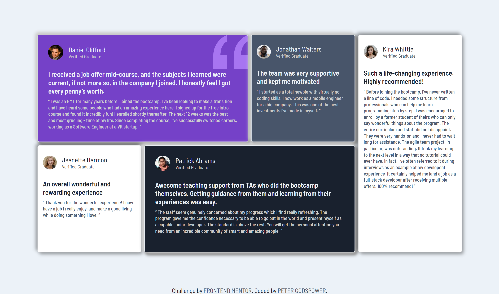

# Frontend Mentor | Testimonials-grid-section

This is a solution to the Testimonials-grid-section challenge on Frontend Mentor. The project involves creating a visually appealing and responsive card feature section, showcasing modern web design techniques.

## Table of Contents

- [Overview](#overview)
  - [Screenshot](#screenshot)
  - [Links](#links)
- [My Process](#my-process)
  - [Built With](#built-with)
  - [What I Learned](#what-i-learned)
  - [Continued Development](#continued-development)
  - [Useful Resources](#useful-resources)
- [Author](#author)
- [Acknowledgments](#acknowledgments)

## Overview

### Screenshot

### Links

- Solution URL: [Frontend Mentor Solution](https://www.frontendmentor.io/solutions)
- Live Site URL: [Live Demo](https://your-live-site-url.com)

## My Process

I approached this project by focusing on creating a visually appealing and responsive card feature section using modern web design techniques.

### Built With

- Semantic HTML5 markup
- CSS custom properties for theming
- Flexbox for layout management
- Responsive design using `clamp()` and viewport-relative units (vw)
- Google Fonts - "Barlow Semi Condensed" for typography

### What I Learned

This project reinforced my knowledge in:

- **Responsive Design:** Leveraging `clamp()` for fluid and adaptable font sizes and spacing.
- **CSS Variables:** Utilizing custom properties for consistent theming and easier maintenance.
- **Accessibility:** Ensuring the design is both responsive and accessible.

### Continued Development

Future projects will focus on:

- **CSS Grid:** For more advanced and intricate layouts.
- **JavaScript:** Integrating interactive features to enhance user experience.
- **Accessibility & SEO:** Improving practices to make sites more inclusive and search-engine friendly.

### Useful Resources

- [MDN Web Docs](https://developer.mozilla.org/en-US/) - Comprehensive web development documentation.
- [CSS-Tricks](https://css-tricks.com/) - In-depth tutorials and articles on modern CSS techniques.
- [Frontend Mentor](https://www.frontendmentor.io/) - Challenges and community support for frontend development.

## Author

- **Frontend Mentor:** [@Peter Godspower](https://www.frontendmentor.io/profile/TheBeyonder616)
- **GitHub:** [TheBeyonder616](https://github.com/TheBeyonder616)

## Acknowledgments

I would like to thank Frontend Mentor for providing this challenging and educational opportunity. A special thanks to the community for its valuable feedback and support.
